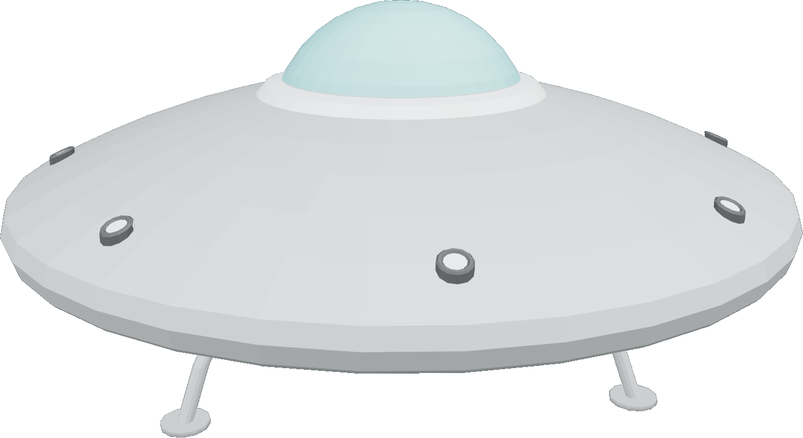

<h1 style="text-align: center; color: #e58d0b; text-decoration: underline">Saucer</h1>

<h2 style="text-align: center">Requirements</h2>
- PHP 8.3 or lower (Tested and developed in PHP 8.3.1)
- Symfony
- A DB (preferably MySQL)
- (npm or bun or yarn) and Node

<h2 style="text-align: center">Quickstart</h2>
No time to waste ? Copy-paste the following shell commands.

Without symfony-cli
```shell
php bin/console doctrine:database:create
php bin/console doctrine:migrations:generate
php bin/console doctrine:migrations:migrate
php bin/console doctrine:fixtures:load
```

With symfony cli
```shell
symfony console doctrine:database:create
symfony console doctrine:migrations:generate
symfony console doctrine:migrations:migrate
symfony console doctrine:fixtures:load
```

<h2 style="text-align: center">Install</h2>
First, you'll have to edit the .ENV
file that you have, to match the database connection that you have.


Next, these commands have to be run in order for the project to start:

Without symfony-cli
```shell
php bin/console doctrine:database:create
php bin/console doctrine:migrations:generate
php bin/console doctrine:migrations:migrate
```

With symfony cli
```shell
symfony console doctrine:database:create
symfony console doctrine:migrations:generate
symfony console doctrine:migrations:migrate
```

<h2 style="text-align: center">Fixtures</h2>
Fixtures are present in this project.
To run them, execute the following command:


```shell
php bin/console doctrine:fixtures:load
```
OR
```shell
symfony console doctrine:fixtures:load
```

<h3 style="text-align: center">Users</h3>
2 distinct users are created from fixtures:

| User            | Password  | Role          |
|-----------------|-----------|---------------|
| user@saucer.fr  | user1234  | Simple user   |
| admin@saucer.fr | admin1234 | Administrator |

<h3 style="text-align: center">Ustensils</h3>
15 ustensils are available for you to choose, or create from:

- Air frier
- Pan
- Wooden spoon
- Frying pan
- Saucepan
- Knife
- Fork
- Measuring cup
- Peeler
- Whisk
- Cutting board
- Colander
- Bowl
- Hoven
- Spoon

<h3 style="text-align: center">Ingredients</h3>
21 ingredients to choose from:
- Flour
- Vinegar
- Cooking oil
- Paprika
- Egg
- Rice
- Salt
- Canned tomatoes
- Onions
- Sugar
- Milk
- Mustard
- Butter
- Capers
- Cheese
- Chicken
- Beef
- Pork
- Garlic
- Ginger
- Mayonnaise

<h2 style="text-align: center">Start (front & mails)</h2>
With all that, you are ready to run the project.
Paste the following commands in a terminal:


<h4 style="text-align: center">npm</h4>

```shell
npm run build
npm run mails
```

<h4 style="text-align: center">bun</h4>

```shell
bun run build
bun run mails
```

<h4 style="text-align: center">yarn</h4>

```shell
yarn run build
yarn run mails
```
<h2 style="text-align: center">Start (Back-end)</h2>
Now, you can start the project, but for the back-end. In a new terminal, start the symfony server:

<h3 style="text-align: center">Without Symfony-cli</h3>
```shell
php -S 127.0.0.1:8000 -t public/
```

<h3 style="text-align: center">With Symfony-cli (recommanded)</h3>
```shell
symfony server:start
```